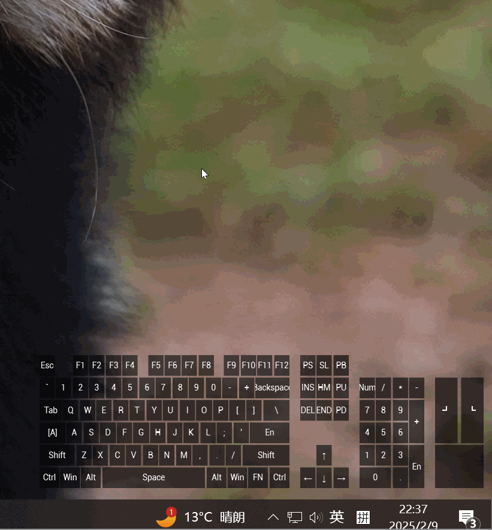
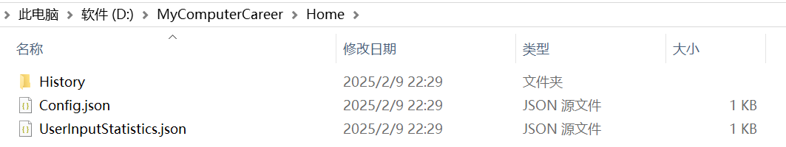

# My Computer Career

**My Computer Career** 是一个简单小巧的Windows工具，它可以用来记录用户对计算机输入设备的使用情况：

你可以轻易地拖拽它的位置，并使用滚轮对它进行缩放，它还有三个简单的按钮：

- ⛵：显示统计面板
- √：是否开机自启
- X：退出程序

## Get It

这是程序的发布页面，你可以从这里获取到已经构建好的可执行版本：

- https://github.com/Italink/MyComputerCareer/releases/tag/V1.0.0

## Build

该程序使用 Qt 6.8 + CMake进行构建，您可以安装相关环境任意修改代码

## Other

程序的数据都存储在根目录的Home文件夹下：

- `History` ： 包含完整的输入事件信息
- `Config.json`：程序的配置文件
- `UserInputStatistics.json`： 用户输入的统计

**！！！警告**

- 不要泄露History，因为它包含您完整的操作记录，存储它是为了未来的报告生成功能~
